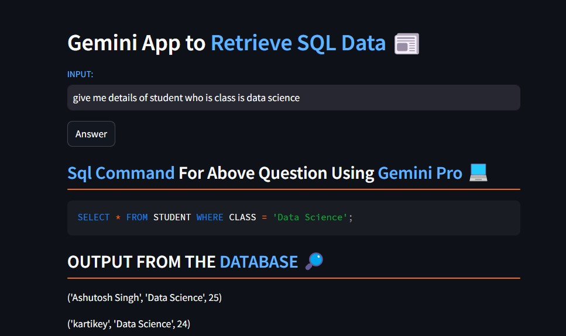
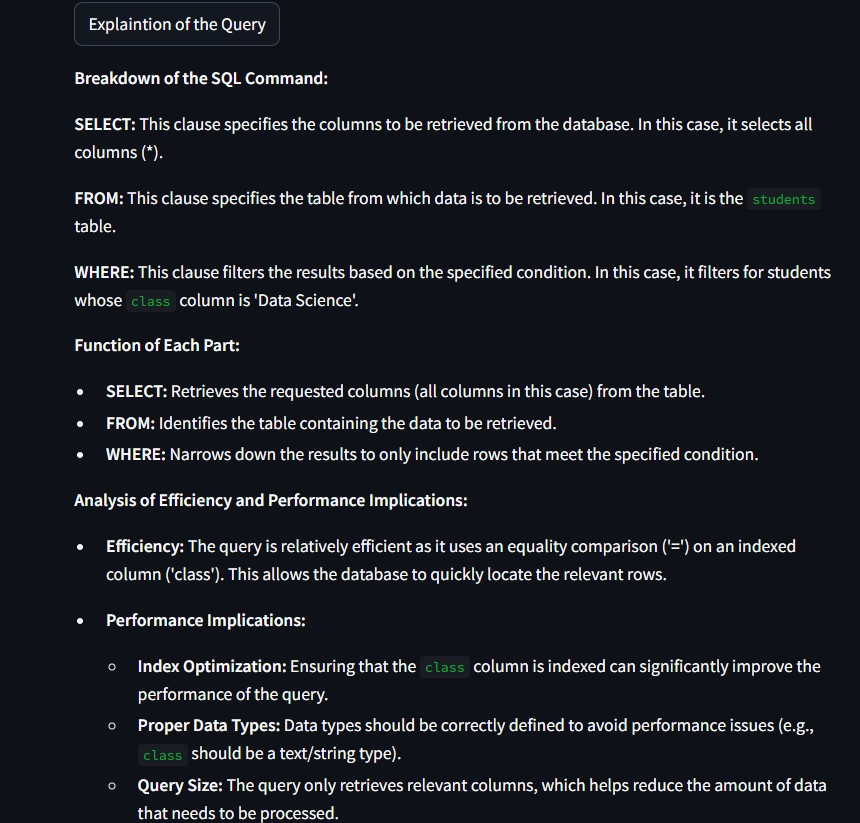
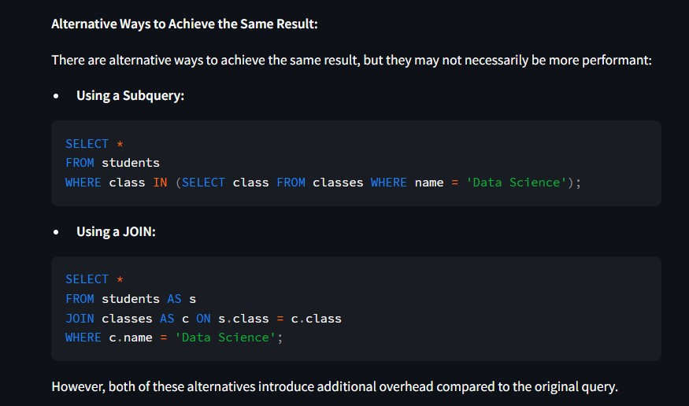

## Text-to-SQL with Gemini Pro

This project empowers you to translate natural language queries into corresponding SQL queries, leveraging the power of Google's advanced Generative AI model, Gemini Pro. This enables intuitive and user-friendly interaction with your SQL databases.
Link:https://huggingface.co/spaces/ashu2000/TEXTtoSQL

## Explaination of Query

## Key Features

- End-to-End AI Model: Harness the state-of-the-art Gemini Pro model for robust natural language processing and SQL query generation.
- Flexible Database Support: Seamlessly work with various SQL databases, providing adaptability to your specific needs.
- Streamlit Interface : Create a user-friendly web application with Streamlit for effortless interaction with the text-to-SQL functionality.
- Customization (Optional): (If implemented) Tailor the project to your database schema and query preferences, ensuring optimal results.

## Getting Started

## Prerequisites:

- Python 3.x (https://www.python.org/downloads/)
- Required Libraries (Install using pip install <package_name> for each):
- transformers (for interacting with Gemini Pro)
- [Database-specific library] (e.g., sqlite3 for SQLite)
- streamlit (for web interface)
  
